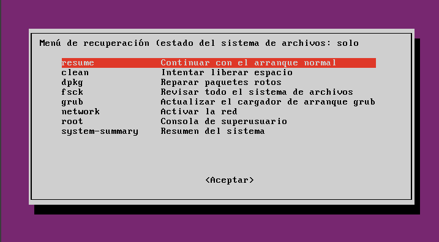
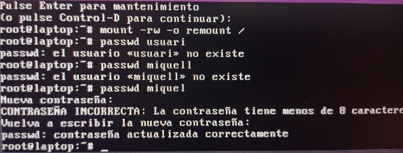
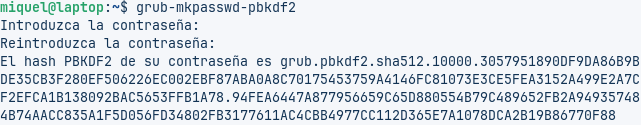
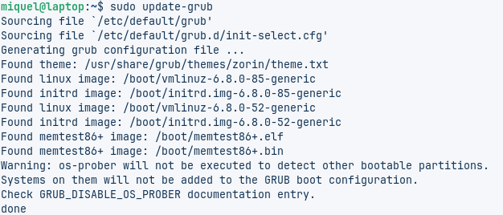
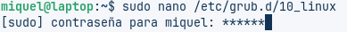
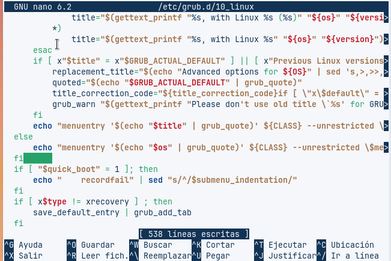
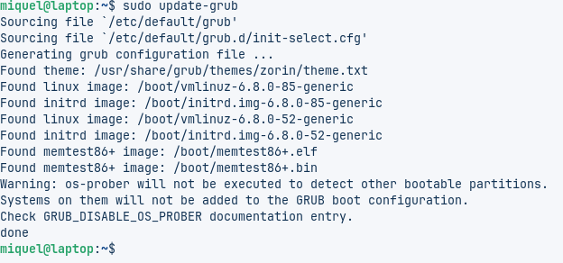

# Canvi de contrasenya i millora de seguretat

Pas1: Cuan engeguem la maquina virtual cliquem shift + la tecla indicat en la pantalla

Pas2: Per segon, cuan aparexi una finestra de color lila, selecciona la opcio (root) 

Pas3: Despres posarem una comanda per muntar en mode lectura/escritura, una vegade fet cambiarem la contrasenya del usuari

Pas4: Iniciarem i posarem la contrasenya que em posat per comprovar que tot estigui correcte

Pas5: Abrirem el terminal i posarem la seguent comanda per veure i copiar el hash del group

Pas6: Despres obrirem el fitxer de modificacio de group i posarem el seguent codi utlitzant el hash del group

Pas7: actualitzarem el grup

Pas8: 

pas9:

pas10:

# Webgrafia
- [https://www.gnu.org/software/grub/manual/grub/html_node/Simple-password-protection.html](https://www.gnu.org/software/grub/manual/grub/html_node/Simple-password-protection.html)
- [https://help.ubuntu.com/community/Grub2/Passwords](https://help.ubuntu.com/community/Grub2/Passwords)
- [https://askubuntu.com](https://askubuntu.com)
